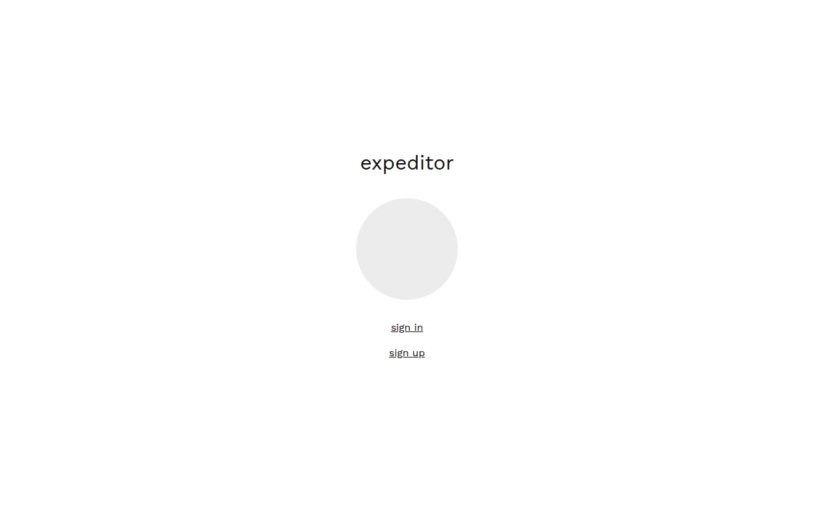
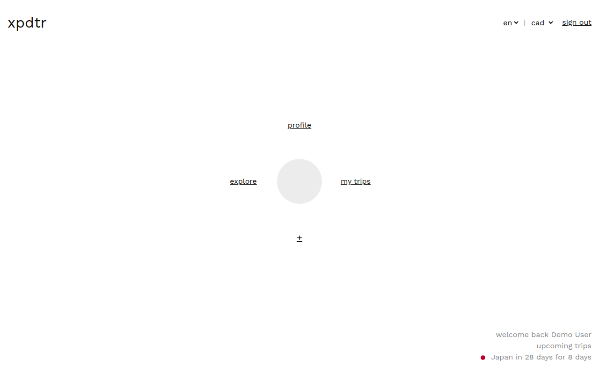
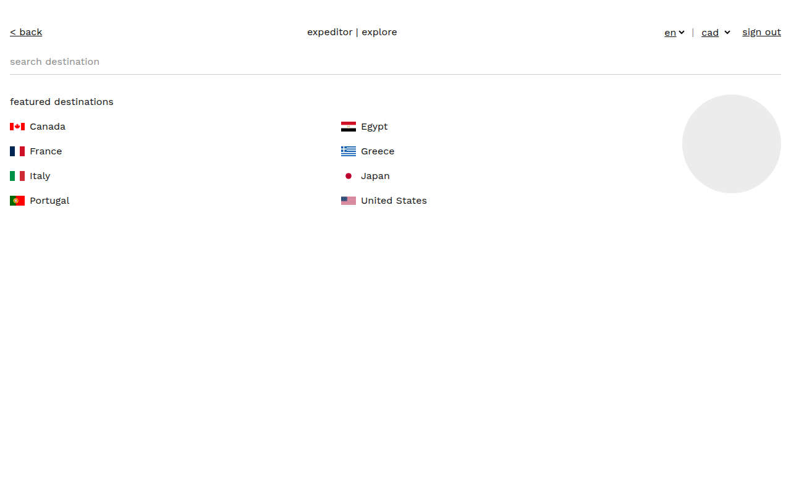
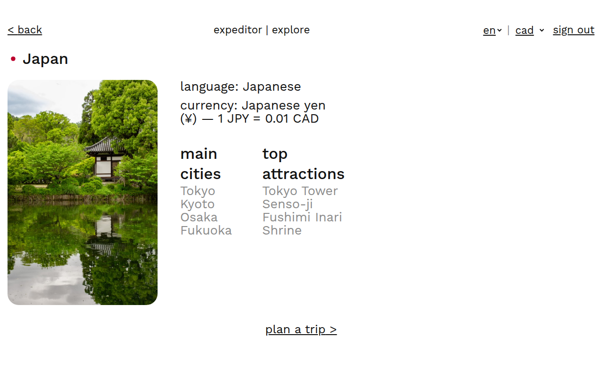
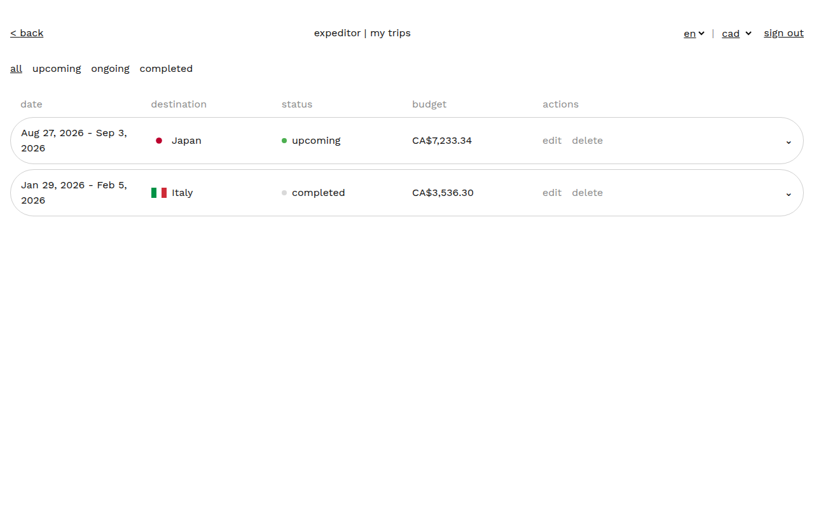
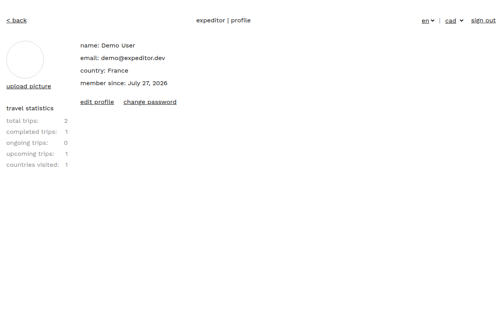

# expeditor

[](https://github.com/vye-ad/capstone/actions/workflows/ci.yml)

A personal trip planner. Browse country destinations, then create, track,
edit, and delete your own trips — bilingual-plus (English, French, Spanish)
and multi-currency. Built as a solo, 4-week capstone project.

> **Status:** in progress (Week 4 — polish). All graded must-haves (Weeks
> 1-3) are complete, deployed, and verified live. Remaining: page
> transitions, an optional 3D globe, and automated tests if time allows —
> see `DEVELOPMENT.md` §15 for the full checklist.

## Screenshots

| | |
|---|---|
|  |  |
|  |  |
|  |  |

## Live deployment

**https://capstone-lovat-kappa.vercel.app** (frontend, Vercel) — backend on
Render (`https://expeditor-api.onrender.com`), database on Prisma Postgres.
See [Deployment](#deployment) below for the setup used to get it there.

Note: Render's free tier spins the backend down after 15 min idle — the
first request after a quiet spell takes 30-60s to wake up.

## Tech stack

| Layer | Choice |
|---|---|
| Frontend | React 18 + Vite |
| Styling | Tailwind CSS |
| Routing | React Router v6 |
| i18n | react-i18next |
| Backend | Node.js + Express |
| Database | PostgreSQL |
| ORM | Prisma |
| Auth | JWT in an httpOnly cookie |
| Password hashing | bcrypt |
| Image storage | Cloudinary |
| Validation | Zod (shared client/server schemas) |
| CI/CD | GitHub Actions |
| API testing | Postman |

See `DEVELOPMENT.md` for the full specification and rationale behind each choice.

## Local setup

### Prerequisites

- Node.js 22+
- PostgreSQL running locally (or reachable via `DATABASE_URL`)

### Install

```bash
cd client && npm install
cd ../server && npm install
```

### Environment variables

Copy the example files and fill in real values:

```bash
cp server/.env.example server/.env
cp client/.env.example client/.env
```

`server/.env` needs a running Postgres instance for `DATABASE_URL`, a
`JWT_SECRET`, and API keys for Cloudinary / Pexels / an exchange rate
provider / REST Countries (v5 requires a free account — see
`DEVELOPMENT.md` §12.1). `client/.env` only needs the backend's base URL.

### Migrate and seed

```bash
cd server
npx prisma migrate dev
npx prisma db seed
```

### Run

```bash
# Terminal 1 — backend
cd server && npm run dev

# Terminal 2 — frontend
cd client && npm run dev
```

## Testing

Backend: Jest + Supertest, run against a real Postgres database (not
mocked) — consistent with this project's "verify for real" approach
elsewhere. Covers the trip status resolver, Zod validation schemas, and
the three trickiest documented invariants: identical login errors for
unknown-email vs wrong-password (§9), 404-not-403 on another user's
trip (§8), and the admin self-modification guard (§10.10).

```bash
cd server
createdb expeditor_test          # one-time
cp .env.test.example .env.test   # fill in your local Postgres credentials
DATABASE_URL="<.env.test's DATABASE_URL>" npx prisma migrate deploy
npm test
```

Frontend: Vitest + React Testing Library. Covers the pure helpers
(currency conversion, status derivation, country-name localisation, Zod
error mapping) and `CountrySelect`'s search/empty-state/keyboard
behaviour.

```bash
cd client && npm test
```

Both suites run in CI on every push (see `.github/workflows/ci.yml`).

## API overview

Import `postman/expeditor.postman_collection.json` plus the
`local-user`/`local-admin` environment files into Postman to exercise the
API directly. `local-user` already has working demo credentials (seeded by
`prisma db seed`); `local-admin`'s email/password are left blank in the
committed file — fill them in yourself from your own `server/.env`'s
`SEED_ADMIN_EMAIL`/`SEED_ADMIN_PASSWORD` rather than committing them.
See `DEVELOPMENT.md` §8 for the full endpoint reference.

The committed collection covers Auth, Trips, and Countries; it was
generated in Week 2 and hasn't been regenerated since Profile, Rates, and
Admin endpoints landed in Week 3 (see `DEVELOPMENT.md` §16). Those three
have been verified through the actual frontend and against the live
deployment instead.

## Deployment

Three services: **Vercel** (frontend), **Render** (backend, free tier —
free web services spin down after 15 min idle, so the first request after
a quiet spell takes 30-60s to wake up), **Prisma Postgres** (database).

### 1. Database

Already provisioned on Prisma Postgres — grab the **direct** Postgres
connection string (not the Accelerate/`prisma://` one — this project uses
the classic `prisma-client-js` generator, not the Accelerate extension).

### 2. Backend (Render)

This repo includes `render.yaml` (a Blueprint) describing the service:
Node runtime, `server/` as root, builds with
`npm install && npx prisma generate && npx prisma migrate deploy` (so
migrations apply to production on every deploy), starts with `npm start`.

1. On Render: **New → Blueprint**, connect this GitHub repo.
2. Render reads `render.yaml` and prompts for the env vars marked
   `sync: false` — fill in `DATABASE_URL` (from step 1), a fresh
   `JWT_SECRET` (don't reuse the local dev one), `CLOUDINARY_*`,
   `PEXELS_API_KEY`, `REST_COUNTRIES_API_KEY`, `SEED_ADMIN_EMAIL`/
   `SEED_ADMIN_PASSWORD`. Leave `CLIENT_ORIGIN` blank for now — the
   frontend doesn't exist yet.
3. Deploy. Note the resulting URL (e.g. `https://expeditor-api.onrender.com`).
4. `migrate deploy` only applies migrations — it does not seed. Run the
   seed once against production yourself, e.g.
   `DATABASE_URL="<production connection string>" npx prisma db seed`
   from `server/` locally. Without this, registration fails with an
   "unknown country" error because the `Country` table is empty.

### 3. Frontend (Vercel)

`client/vercel.json` adds the SPA rewrite React Router needs (without it,
refreshing any route other than `/` 404s).

1. On Vercel: **Add New → Project**, import this repo, set **Root
   Directory** to `client`.
2. Add an environment variable: `VITE_API_BASE_URL` = the Render URL from
   step 2.
3. Deploy. Note the resulting URL (e.g. `https://expeditor.vercel.app`).

### 4. Close the loop

Go back to the Render service's environment settings and set
`CLIENT_ORIGIN` to the Vercel URL from step 3, then trigger a redeploy —
CORS won't accept requests from the frontend until this is set.

**Gotcha:** `CLIENT_ORIGIN` must match the browser's `Origin` header
byte-for-byte — no trailing slash (`https://your-app.vercel.app`, not
`https://your-app.vercel.app/`). A trailing slash passes every `curl`
check (curl doesn't enforce CORS) but silently fails in a real browser,
since the `Origin` header it sends never has one.

## Database schema

See `DEVELOPMENT.md` §6 for the Prisma schema (`User`, `Trip`, `Country`,
`City`, `Attraction`, `ExchangeRateSnapshot`) and the reasoning behind each
field.

## Attribution

| Resource | Used for | Link |
|---|---|---|
| REST Countries API (v5) | Country reference data | https://restcountries.com |
| Pexels API | Destination image fallback | https://www.pexels.com/api/ |
| Cloudinary | Image storage and transformation | https://cloudinary.com |
| Exchange rate provider (open.er-api.com) | Currency conversion | https://www.exchangerate-api.com/docs/free |
| Tailwind CSS | Styling | https://tailwindcss.com |
| Prisma | ORM | https://www.prisma.io |
| react-i18next | Internationalisation | https://react.i18next.com |

Updated as each dependency is actually introduced.

## Original work statement

All application code (React components, Express routes/controllers,
Prisma schema, seed logic) is original, written for this course. Third-party
libraries and APIs are listed under Attribution above; any code adapted
from documentation, Stack Overflow, or a tutorial will be cited inline and
added to that table.
